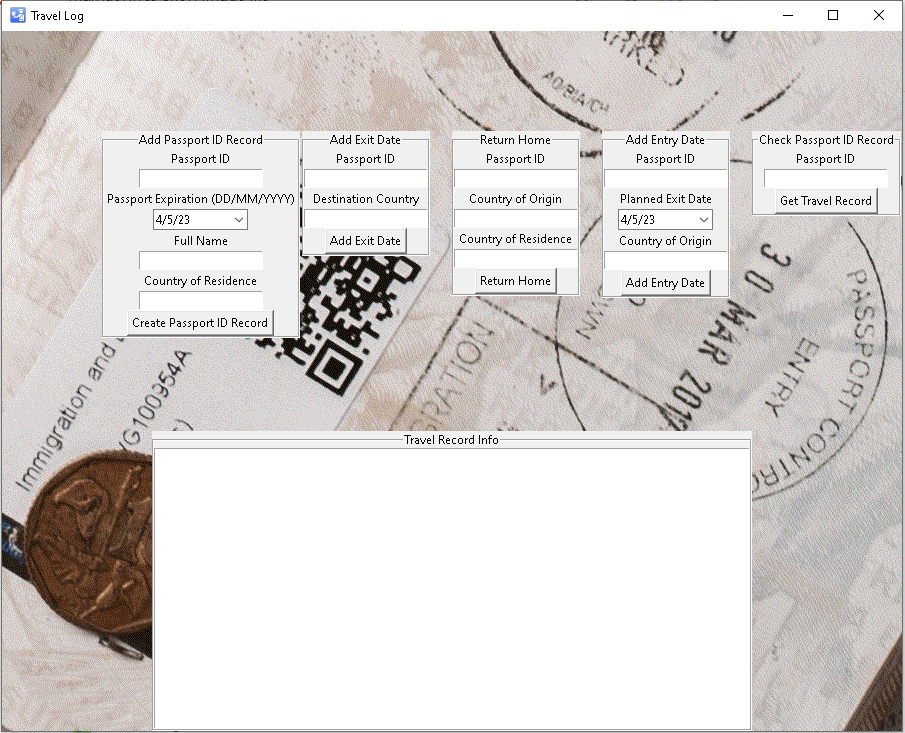

# BlockChain Passport

## Executive Summary:

The goal of our Application is intended for customs agents to use as a validation method for travelers.
The appication will consist of a solidity smart contract and python GUI application. 
This will aim to prevent illegal travel between countries and fraudulent customs reporting.
The smart contract first creates a hashed ID associated with the users passport ID.
This is then used to record any exit/entry/return actions for that user.

## Technologies:

- remix : https://remix.ethereum.org/
- solidity: https://github.com/ethereum/solidity
- web3 : https://web3py.readthedocs.io/en/stable/overview.html
- tkinter : https://docs.python.org/3/library/tkinter.html 
- tkcalendar : https://pypi.org/project/tkcalendar/
- dateutil : https://pypi.org/project/python-dateutil/

## Contract Details:

The contract consists of a TravelRecord struct that stores the following information:

Passport ID
Passport expiration date
Full name
Country of residence
Country of origin
Destination country
Entry date
Planned exit date
Actual exit date

Note that the addPassportID function can only be called by the contract admin.
The other functions can also only be called by the contract admin, to ensure the security and accuracy of the data.

## Application Fail-Safes:

Travelers are not allowed to enter a country without having a recorded exit.
Travelers can distinguish between leaving a country, entering a foreign country, and returning home to their country of residence.
Records the time of entry/exit/return as the blockstamp time when the contract is called, i.e. a future/past time cannot be entered
The user cannot create multiple accounts, and cannot 'return home' to a country not listed as their residence.
The contract checks the users passport expiration and will not allow them to create an ID if its within 6 months. 

## Steps to Deploy the Application:

1. Open Ganache and create a quick start session

2. Connect MetaMask to the Remix environment with one of your accounts with available Eth funds from your testnet

3. Compiled the passport.sol contract using Solidity version 0.8.0 or higher

4. Copy the smart contract address and deployer address into the .env file, save it

5. Then run the gui.py Python application to open up the GUI

## Usage of the Application:

Here is a description of how to interact with each field and button:

### Add Passport ID Record:
This section contains input fields for creating a new passport ID record in the TravelRecords folder of the smart contract.
Here the user will need to enter the passport ID number, expiration date, full name, and country of residence.
The expiration date should be entered in the format DD/MM/YYYY.
Once the user has entered all the required information, click the "Add Passport ID" button to create the record on the blockchain.

### Add Entry Date:
This section contains input fields for adding an entry date to a passport ID.
Here the user will need to enter the passport ID number, planned exit date, and country of origin.
The planned exit date should be entered in the format DD/MM/YYYY.
Once the user has entered all the required information, click the "Add Entry Date" button to update the record on the blockchain.

### Add Exit Date:
This section contains input fields for adding an exit date to a passport ID.
Here the user will need to enter the passport ID number and destination country.
Once the user has entered all the required information, click the "Add Exit Date" button to update the record on the blockchain.

### Return Home:
This section contains input fields for marking a passport ID as returned home. 
The user will need to enter the passport ID number, country of origin, and country of residence. 
Once the users have entered all the required information, click the "Return Home" button to update the record on the blockchain.

### Check Passport ID Record:
This section contains an input field for checking a passport ID.
The user will need to enter the passport ID number.
Once the user has entered the passport ID number, click the "Get Travel Record" button to view the record on the blockchain.

Travel Record Info: This section displays the results of your interactions with the blockchain.
If the user creates, updates, or views a travel record, the results will be displayed here.

Note that all the functions can only be called by the contract admin to ensure the security and accuracy of the data.

## License:

This smart contract is licensed under the MIT License.

